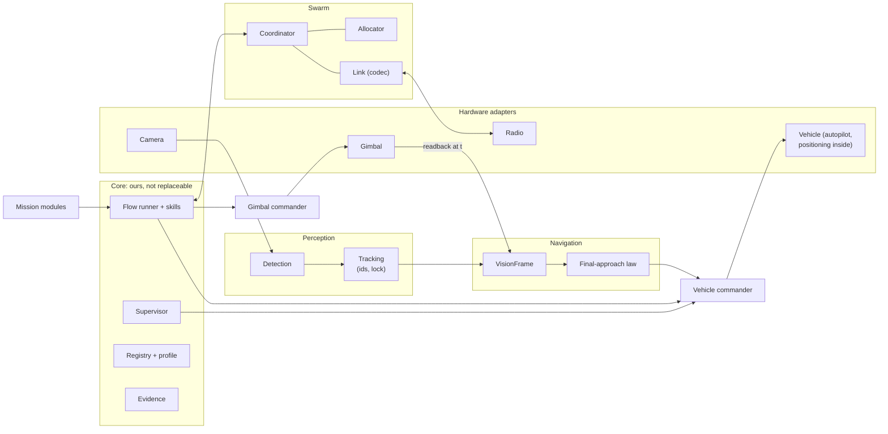

# Replaceable components (draft, 2026-10-08)

**Goal:** any part can later be bought, contracted out or rewritten without touching the rest.
Missions and flows are covered in `mission_modules.md` and `flow_runner.md`. This doc covers
the parts underneath them. Paths are under `src/navpy/modules/`. Evidence is from code reading
only.

## Rules
1. **Port.**
   - Each replaceable part sits behind a port: neutral data types, timing and invariants.
   - The core owns ports and their types (`navpy/ports/`). An implementation never defines a shared type.
2. **Registry.**
   - Each port has one registry.
   - The composition root picks the implementations from the vehicle profile, which is config.
   - No backend name is checked anywhere else, and a guard test enforces that.
3. **Kit.**
   - Each port has a conformance kit: contract tests, replay or sim scenarios, and scores.
   - A replacement is accepted when it passes the kit, not by reviewing its internals.
4. **Stamps.**
   - Data carries the capture time, the frame sequence and provenance (component, version, config hash).
   - So every SNAP says which parts produced it.
5. **Process.**
   - Components run in-process by default.
   - Any port can run out of process through one generic adapter that uses the same types.
   - Contractor binaries always run out of process.
6. **Failure.**
   - Each component reports its health and has a deadline.
   - A missed deadline or a failure makes the supervisor hold. Components never own safety.
7. **One owner per actuator.**
   - The gimbal and the vehicle each have one commander, which arbitrates between requests.
   - Skills send requests to the commander and never drive the device directly.
   - This is the manager/device split of the MAVLink Gimbal Protocol v2.
8. **Bundles.** One contractor component may fill adjacent ports, for example detection plus tracking, or tracking on the gimbal, as long as it emits the downstream port's types.
9. **Pure vision at the boundary.**
   - The law sees only `VisionFrame`.
   - Every component upstream of the law (detection, tracking) must pass the kit's truth test: changing compass yaw, ground speed, altitude or geo truth leaves its output unchanged.

10. **Declared inputs.**
    - A plugin only takes inputs and returns outputs.
    - It declares its required inputs and their quality, for example GPS CEP, frame rate, latency or real airspeed, and it receives only those.
    - The mission builder matches these declarations against the vehicle's data sources. It shows which plugins are available and what is missing for the rest.
    - This happens at setup: a preflight self-test measures the real quality, and the choice is latched at arming. Nothing is re-checked or switched in flight.

## Map

## Ports
| # | Port | In → out | Today | Main gap |
|---|---|---|---|---|
| 1 | Vehicle | mode intents (hold, mission, external control), setpoints, neutral mission items → telemetry | `IVehicle` (11 ABCs), one implementation | MAVLink types and ArduPlane modes leak in; mission writers build raw MAVLink (`navigation/mission_approach_writer.py:10-18`). Acceptable while only ArduPilot is in scope |
| 2 | Camera | → frame + `CaptureStamp` | `FrameCaptureBackend` | backend choice is hard-imported (`vision/frame_capture_runtime.py:10,68`) |
| 3 | Gimbal | modes (stow, hold, geo-point, rate), zoom → readback at time t | fat `GimbalAbc` | SIYI mode numbers in navigation; 7 direct callers; readback taken at pairing, not capture (moving gimbal fails closed) |
| 4 | Detection | frame + seq → boxes, class from a catalog, confidence | `FrameDetector` | dock-only classes; `Detection` lives in `yolo_detector.py`; 6 name checks |
| 5 | Tracking | detections + capture time → stable-id tracks (measured or predicted) + locked POI | `TrackerBackend`, inner engine only | identity, lock and bridge are concrete; no capture time; the sim skips it |
| 6 | Final-approach law | `VisionFrame` → plan (command, within limits, reason, evidence); plan, commit, reset | 3 implicit Protocols | PN-shaped plan; hardcoded in 5 places |
| 7 | Swarm coordinator | fleet state, task offer/assign/release/handover → assignments | none; nav builds `TaskActor` (`nav/nav_network.py:24,59`) | add the port; take task data, not `DetectedObject` |
| 8 | Allocator | offers + costs → assignments | `TaskAssignmentPlanner` (Hungarian) | hardcoded (`swarm/task_actor.py:66`); CBBA replaces the coordinator, not this |
| 9 | Link | messages ↔ bytes over a radio | `NetworkAbc` | codec inside the messages (pymavlink imports); RFD900 hardcoded; custom message ids need a custom ArduPilot build |
| 10 | Positioning | none | autopilot EKF3 (decided) | none in NavPy |
| 11 | Mission module | graph, skills, task kinds, params, GCS plugin | designed (`flow_runner.md`) | task kinds closed to DOCK |
| 12 | Scenario intelligence | scene (camera, map, sensors) → strategy (mission plan, law, profile) | none | later: an AI model, not a heuristic; never feeds the vision law's commands |

## Order
Each step is small. C0-C2 change no behavior. `roadmap.md` says which land before the demo.
- **C0 Types.** Move shared types into `navpy/ports/`, with no shims.
- **C1 Registry and profile.**
  - Replace the if-chains: detector, law, gimbal, capture, network, vehicle.
  - Add the guard test.
- **C2 Kits** for detection, tracking and the law, the likely first contracts. Detection and tracking need labelled clips.
- **C3 Port fixes, one task each, with tests:** tracking port, law contract, gimbal split, swarm coordinator, codec. Vehicle mode intents wait until another autopilot is in scope.
- **C4 Out-of-process adapter.** Built when the first contractor arrives.
- **Fit with the other plans.**
  - C0-C1 run alongside F1-F2, and the law contract lands with P3.
  - The pickup line class and `line_dive` become the first registered plug-ins.
- **Not now: ROS 2.** It gives processes and topics, but it means a full migration and still gives neither the kits nor the pure-vision boundary.

## Swarm kit
A box that turns a UAV into a swarm member: companion computer, camera (gimbal optional), its
own mesh radio and power, with one MAVLink cable to the autopilot.
- **Decided (2026-10-09): ArduPilot fixed-wing only at first.** PX4, multirotor, VTOL and closed autopilots come later.
- **Needed:**
  - Its own radio, box to box, so the autopilot never carries our messages.
  - An airframe profile: limits, gains, the camera-to-body mount, and its data sources with their quality (GPS CEP, camera rate and latency, pitot).
  - An install calibration and an acceptance flight.
  - The autopilot is identified from its heartbeat; anything that isn't ArduPlane is refused.
- **Decided (2026-10-09): stock ArduPilot firmware, no custom build.**
  - Today ArduPlane drops message ids it wasn't compiled with, so every navlink message needs a firmware, mavlink-router and pymavlink rebuild (`scripts/add_navlink_message.py:9-11`).
  - Fix: our messages travel inside the standard `TUNNEL` message (id 385, 128-byte payload). All 15 of ours are 101 bytes or less. Stock firmware forwards it by target, or to every link when broadcast (`libraries/GCS_MAVLink/MAVLink_routing.cpp:148-216` in ArduPilot).
  - Use a private payload type (32768 or above) for now, and register a block with MAVLink before release. Registering is a spec entry only; the firmware doesn't change.

## Open owner questions
1. Which part is most likely to be contracted out first? Its kit gets built first.

**Decided (2026-10-09):** the MVP uses what we have: ArduPilot Lua settings on a board with scripting.
The box serving its own settings comes later. Keep every part modular so other autopilots can be added.
