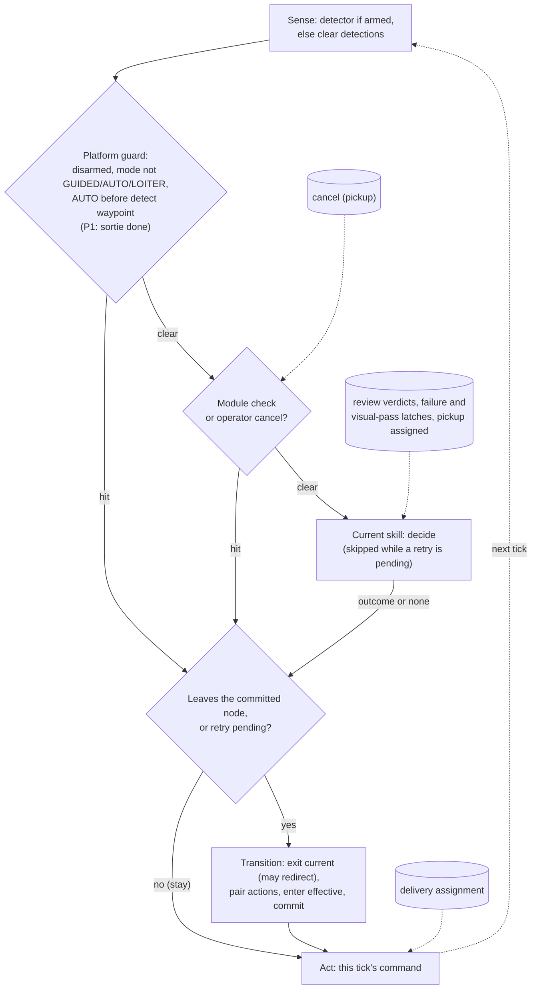
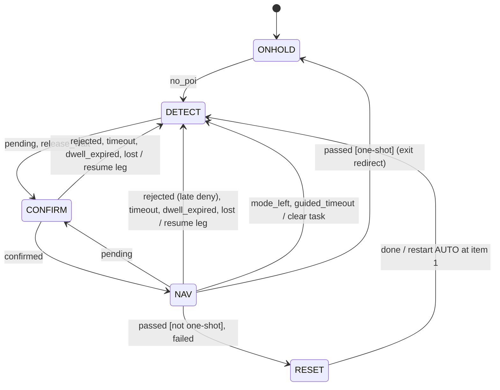
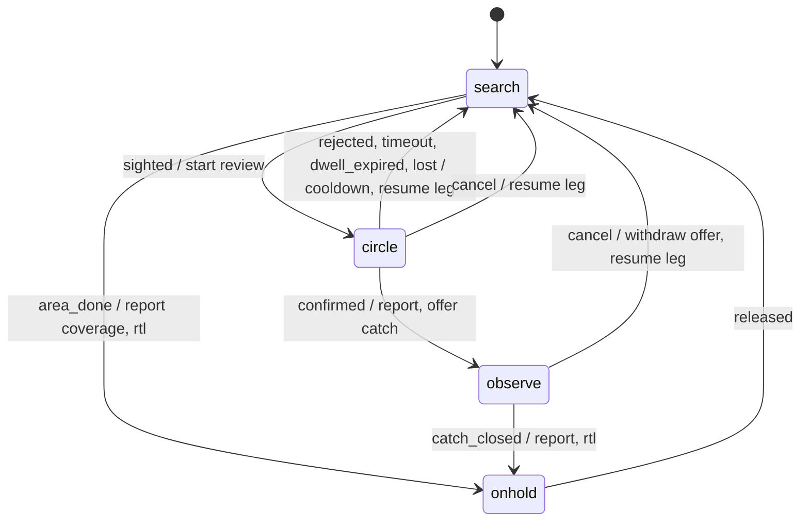
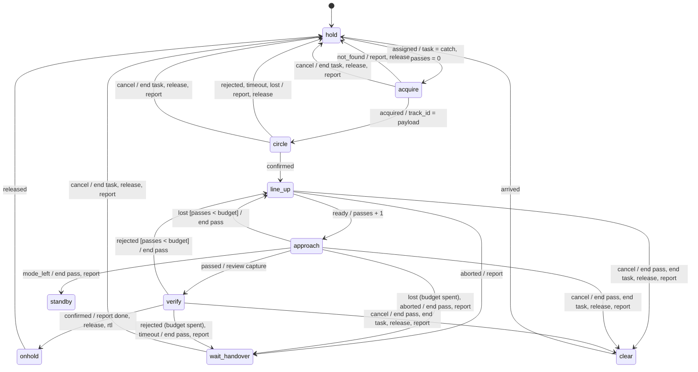

# Design: flow runner (draft, 2026-10-08)

Status: for review; nothing is implemented. Implements "Flows are graphs" (`docs/design/mission_modules.md`, Mission modules)
and replaces S3's FlowHooks (`docs/design/architecture_split.md`, Slices). Paths are under `src/navpy/modules/`
unless they start with `tests/`, `scripts/`, `docs/` or `src/`. UNVERIFIED = not checked.

## 1. Concepts
- **Graph:** one per role. Nodes run skills (flight activities); edges are named outcomes with an optional
  guard and actions. A node is `safe` if the autopilot holds a safe state when the companion stops.
- **Label graphs** (delivery v1): node ids are the NavState members; the runner is today's machine with its
  tables built from the graph, its skills are records of today's enter, act and exit callables, and its
  decide side is today's chain. **Node graphs** (pickup, P1): node ids are module enums with a NavState label.
- **Supervisor:** the platform guard (disarmed, mode_hold, wp_hold; from P1 a sortie-done hold) is
  platform-owned. Every node gets one fixed edge per guard event, always to the platform `onhold`; a graph
  may attach best-effort cleanup, never another target. Module checks (safety, or operator such as cancel)
  are module edges with a scope. Services (review, tasking, report and offer, presence) run on their own
  threads and never call the runner.
- **Task context** (node graphs only): `task_id`, `track_id`, `anchor`, `budget`, `passes`, written only
  by edge actions at commit. Delivery has none; its owners stay put (`nav/nav_state.py:118-194`).
- **Lifecycle:** enter; tick and act each loop tick; outcome; exit. Exit runs on every transition, on
  preemption (`aborted:<event>`) and, in node graphs, at stop or after a fatal loop exit (`aborted:shutdown`,
  best effort, after the loop quiesced). Delivery keeps NavShutdown as is (`nav/nav_application.py:48-66`):
  its NAV exit would report an extra SNAP. The reset transaction keeps restoring the lease owners
  (`nav/navigation_task_reset.py:139-146`). A fatal stop in a non-safe node relies on the lost-companion fallback.

## 2. API sketch
```python
class Skill(Protocol):
    outcomes: frozenset[str]                           # all that enter, tick and exit may return
    def enter(self) -> Optional[str]: ...              # None = entered, else a refusal (P1)
    def tick(self) -> Optional[Outcome]: ...           # decide phase, after the supervisor (P1)
    def act(self) -> None: ...                         # act phase, every tick, one bounded step
    def exit(self, reason: str) -> Optional[str]: ...  # releases control; may redirect
# frozen dataclasses; actions name entries in the module's table: a context write, a non-blocking
# service call (report, offer, release) or one vehicle command (restart_auto(1), resume_leg, rtl)
class Outcome:   name: str; payload: Optional[int] = None   # e.g. acquire's track id
class Guard:     field: str; op: str; rhs: str | int         # integer context fields only
class Edge:      outcome: str; to: NodeId; guard: Optional[Guard] = None; actions: tuple[str, ...] = ()
class Node:      id: NodeId; label: NavState; skill: Skill; edges: tuple[Edge, ...]; safe: bool = False
class Check:     event: str; scope: frozenset[NodeId]; to: NodeId; actions: tuple[str, ...] = (); operator: bool = False
class FlowGraph: id: str; start: NodeId; nodes: Mapping[NodeId, Node]; checks: tuple[Check, ...]
class FlowRunner:
    def take(self, outcome: str, payload: Optional[int] = None) -> None: ...  # decide phase
    def act(self) -> None: ...                                              # act phase
```
tick and act are separate because the transition runs between them; tests read the requested state after `decide()`.

## 3. Tick algorithm
Same thread and order as today (`nav/navigation_loop.py:118-124`):
1. Sense if armed, else clear detections.
2. Platform guard. A hit takes its fixed edge and ends the decide phase.
3. Module safety checks in scope, then operator checks from task mailboxes (pickup: cancel). A hit ends it.
4. Node decide: the committed skill's tick(), skipped only while a failed transition awaits retry. Label
   graphs run steps 2-4 as today's chain, in today's order (`nav/navigation_decision.py:229-241`).
5. `take(outcome)`. Label graphs resolve (`phase.current`, outcome) and call `phase.request(to)` where
   today's request sits, so other threads see the label at the same point. Node graphs resolve against the
   committed node (first edge whose guard passes), record the edge and publish its label; during a pending
   retry only platform and module edges retarget. At most one take per decide.
6. `act()`. Label graphs keep today's rule verbatim (`nav/navigation_loop.py:86-98`, `nav/navigation_transition_handler.py:68-80`):
   if published != committed, exit(committed), redirect, the (committed, effective) pair's actions,
   enter(effective), commit; then act. No edge is consulted. Node graphs, if a recorded edge leaves the
   committed node or a retry is pending: exit(reason), redirect, actions (context writes staged), enter (a
   refusal runs exit("refused") and takes its refusal edge), commit with the staged writes, a log row; act.
7. Failures. An OSError is logged, nothing commits, the next act retries from the exit (`nav/navigation_loop.py:190-194`);
   anything else stops the loop, including the NAV exit's ExceptionGroup and NavEntry's RuntimeError
   (`nav/nav_transition.py:65-66`, `nav/nav_entry.py:40-44`). Today's exits are not idempotent: a retry after
   a good NAV exit reports a second SNAP (`scripts/eval_ideal_three_uav_vehicle.py:57` wants one). New exits
   are idempotent, service actions carry a key (task_id, edge, episode), vehicle commands may repeat.
- A stay runs nothing and carries no actions. An exit closes what its enter opened (`nav/nav_exit_cleanup.py:38-68`).

## 4. Events and services
No queue: each input is a latest-value slot or a consume-once latch read at a fixed tick point.

| Input | Written by | Read as |
|---|---|---|
| review verdict | review workers, network listener (`nav/confirmation_coordinator.py:47-54`) | the waiting node's outcome; a deny after CONFIRMED is the late-deny cancel |
| PEER_NOTIFIED | peer-dispatch worker (`nav/nav_network.py:84-87`) | delivery: pending or lost, like no status |
| failure latch, visual pass | final-approach worker | failed, passed |
| assignment | network listener (`swarm/task_actor.py:133-137`) | delivery: inside DETECT's act; pickup: `assigned`, only after APPLIED |
| cancel (pickup) | network listener; free request_type, acked | operator check `cancel` |

- Pickup's new mailboxes carry the task id and drop mismatches; delivery's latches stay as they are.
- Node-graph actions and pickup skills write mode and mission through a fence that re-reads armed, mode and
  hold latches at write time (`docs/design/mission_modules.md:74-76`); the mode is the last HEARTBEAT's
  (`vehicle/mode_control.py:54-62`), so it narrows, not closes, the operator-override race. Delivery is unchanged.
- `rtl` sets a sortie-done latch beside the one-shot latch; the platform guard holds while it is set, and
  only disarm clears it (`nav/navigation_decision.py:78`). Nothing reads back a mode it just wrote.

## 5. Load checks
At composition (startup fails) and in one parametrized test per graph:
1. `start` and every edge target exist; no outcome is named like a node.
2. Every declared outcome (redirects and refusals too) has an edge or an in-scope check; no edge names an
   undeclared outcome.
3. Per outcome only the last edge is unguarded, and it must be; a self-edge is a stay with no actions.
4. Every node is reachable from `start` and reaches a safe node through module edges; a node with no
   outcomes leaves only by platform or module edges.
5. No node declares a platform-guard outcome; no module check reuses one.
6. Redirect and refusal edges end at safe nodes; a safe node cannot refuse.
7. (Node graphs) Safety checks (`operator=False`) end at safe nodes and never scope a final_approach node:
   the approach ends only by its vision outcomes, the platform guard or an operator cancel
   (`docs/design/mission_modules.md:169`).
8. (Label graphs) One node per label; one action list per (from, to) label pair; hook tables and action
   map cover exactly the graph's labels.

Delivery's nodes declare what today's chain emits from their label; its legacy floor fires only under a
legacy law (`nav/recovery.py:50-51`). **Invariant:** act (and tick) runs only between enter and exit.

## 6. NavState view
- The label is published at take() and committed after enter(), as today: the event pump's session check
  reads the published label (`nav/nav_final_approach_composition.py:217-226`).
- Delivery: NavPhaseState stays the runner's state and graph-free. Kept: StateActionDispatcher's act rule and
  ValueError (its constructor only gains an optional label set, default every NavState); `_actions` keyed by
  NavState with bound methods (`tests/modules/nav/nav_test_rig.py:179-183`); the handler's on_change,
  enter_reset, `_nav`, TransitionOutcome. Changed: the handler takes its three tables (only
  `nav/nav_runtime_composition.py:100` builds it). take() lives on a runner object injected beside `phase`
  into the 7 producers, all built in composition; what the rig reads stays (`nav_test_rig.py:148-175`).
- Pickup nodes may share a label, but the approach must be NAV: the event pump and the source session gate
  on it. The GCS reads module and node from the heartbeat state byte (`docs/design/mission_modules.md:213`).

## 7. Delivery graph v1 and its code mapping
Files under `nav/`; `dec` = `navigation_decision.py`, `rec` = `recovery.py`, `rej` = `poi_rejection_exit.py`,
`rel` = `confirmed_poi_release.py`. Tables today: `navigation_transition_handler.py:44-63`, `nav_runtime_composition.py:136-147`.
```
graph delivery/uav   ids=NavState   start=ONHOLD   safe={ONHOLD, DETECT}
node      enter                                          act                      exit
ONHOLD    -                                              navigation.pause         -
DETECT    start_task_actor                               DetectAction.act         -
CONFIRM   gate reset(now), start_task_actor              ConfirmationAction.act   gate reset
NAV       NavEntry.run, start_task_actor                 act_nav                  NavTransition.exit
RESET     reset.clear, logger.refresh, start_task_actor  navigation.pause         -
any       disarmed | mode_hold | wp_hold -> ONHOLD       dec:80,86,93
          oneshot_hold -> ONHOLD (not RESET, RECOVERY)   rec:114
RESET     done -> DETECT {restart_auto(1)}               rec:103 (legacy :57)
NAV       mode_left | guided_timeout -> DETECT           dec:163,178
          passed -> RESET                                dec:196, :149
          exit redirect finished -> ONHOLD               nav_transition.py:57-63
ONHOLD, DETECT, CONFIRM, NAV:
          failed -> RESET                                dec:152
          no_poi -> DETECT                               poi_status_decision.py:46
          pending -> CONFIRM                             rej:65,72
          release_wait -> CONFIRM (not from NAV)         rel:41
          confirmed -> NAV                               rel:45
          rejected | timeout | dwell_expired | lost -> DETECT   rej:51-64
legacy fragment, registered with the legacy law (delivery's own graph names none of it):
RECOVERY  enter RecoveryAction.enter, start_task_actor; act RecoveryAction.act
          recovered -> DETECT {restart_auto(1)} (rec:73; vision :106); recovered_hold -> ONHOLD (rec:73)
          floor_low -> RECOVERY, not from RESET (rec:69); RESET low_alt -> RECOVERY (rec:57)
          geo_abort -> DETECT                            track_recovery.py:65-79
no outcome, tick ends: GUIDED wait (dec:165-187); legacy altitude unknown (rec:55-56,63-65)
```
- Each request() becomes take(outcome) in place; work done when an outcome is chosen keeps its order around
  the publish: `_teardown(outcome)` (`rej:98-101`); rec:57-61 and rec:73-77 become two takes over one read.
- Teardowns stay distinct: restart AUTO at item 1 (done, recovered); resume the leg (rejected, timeout,
  dwell_expired, lost, geo_abort; `navigation_task_reset.py:241-267`); neither (mode_left, guided_timeout).
- Pinned as is: in NAV `rejected` is the late deny; a CONFIRMED legacy geo hold re-arms to NAV or aborts
  (`rel:43-45`); pending and lost also fire for PEER_NOTIFIED; the ONHOLD refresh (dec:243-252) is dead
  (architecture_todo task 7). CONFIRM does not circle under vision (`self_detected_approach.py:44-45`): D1.

## 8. Pickup graphs (shape; details in the pickup step)
Actions: report, offer, release, end_task (today's reset transaction), resume_leg (AutoMissionResume), rtl
(RTL plus the sortie-done latch), end_pass (fence the source; reset the failure and visual-pass latches and
command state; keep task, track and passes). No finish: OneShotCompletion disarms in sim (`nav/nav_oneshot_completion.py:58-68`).
```
all      onhold: ONHOLD, safe, act pause; released -> search (scout) or hold (catcher)
         GUIDED nodes: mode_left -> standby {end_pass in a pass; report}; standby: safe, passive, task kept
scout    search   DETECT safe  sighted -> circle {review.start}; area_done -> onhold {report coverage; rtl}
         circle   CONFIRM      confirmed -> observe {report; offer catch(anchor, budget)}
                               rejected | timeout | dwell_expired | lost -> search {cooldown; resume_leg}
         observe  DETECT safe  catch_closed -> onhold {report; rtl}   (re-orbits itself on loss)
         check cancel: circle -> search {resume_leg}; observe -> search {withdraw offer; resume_leg}
catcher  hold     DETECT safe  assigned -> acquire {task := catch; passes := 0}
         acquire  DETECT       acquired -> circle {track_id := payload}; not_found -> hold {report; release}
         circle   CONFIRM      confirmed -> line_up; rejected | timeout | lost -> hold {report; release}
         line_up  DETECT       ready -> approach {passes += 1}; aborted -> wait_handover {report}
         approach NAV          passed -> verify {review.capture}; lost [passes < budget] -> line_up {end_pass}
                               lost | aborted -> wait_handover {end_pass; report}
         verify   DETECT       confirmed -> onhold {report done; release; rtl}
                               rejected [passes < budget] -> line_up {end_pass}
                               rejected | timeout -> wait_handover {end_pass; report}
         clear    DETECT       climb-out to the corridor-clear point; arrived -> hold
         wait_handover DETECT safe  climb-out, then hold at the corridor-clear point; no outcomes
         check cancel (line_up, approach, verify) -> clear {end_pass; end_task; release; report};
               (other task nodes, incl. wait_handover) -> hold {end_task; release; report}
         platform cleanup, disarmed | mode_hold: {end_task; release}
```
- The budget counts started passes; N is a pickup module param copied into the catch task's state
  (`docs/design/mission_modules.md:168`). Backup: the catcher graph with role=backup, bidding the sentinel.
  Handover is one GCS action: cancel the catcher, wait until the owner (scout) applied its release, then
  the owner assigns the backup under a new generation (`docs/design/swarm-task-assignment-ack.md:44`).
- The approach gets only FinalApproachRequest(profile, track_id), never the context view; `passed` comes
  only from the vision pass detector; the pure-vision AST scan extends to the runner, guards and approach.
- Role latch at the arming edge; NavPy cannot refuse arming. Armed without a valid latch (forced arm,
  `src/gcs/backend/routes/control_vehicle_commands.py:74-90`, or a restart in flight): onhold for the sortie, with a status text; plans without module metadata get delivery.

## Diagrams

### Each loop tick

A platform-guard hit always goes to ONHOLD (the platform onhold, act: pause). A module may add best-effort cleanup but never another target. A stay runs no exit, enter or actions. Delivery's assignment is read inside DETECT's act.

### Delivery graph v1 (simplified; legacy RECOVERY fragment omitted)

- Any state goes to ONHOLD on disarmed, mode_hold or wp_hold. Every state except RESET also goes there on oneshot_hold, which keeps the vehicle in ONHOLD until disarm.
- From ONHOLD, DETECT, CONFIRM and NAV, the edge failed -> RESET and every POI-status edge apply. NAV never takes release_wait. Only the main edges are drawn.

### Pickup scout

Every node goes to onhold on disarmed, mode_hold, wp_hold or sortie done.

### Pickup catcher

- Every node goes to onhold on disarmed, mode_hold, wp_hold or sortie done. On disarmed or mode_hold, the catcher also ends and releases the task.
- Standby is safe and passive, and the task is kept.
- The backup runs the same graph.

## 9. Slices
| Id | What | Behavior | When | Size |
|---|---|---|---|---|
| F0 | Tests only. Oracle over (label, outcome): next state, hooks and order, the label seen inside the pre-work mocks; act() without decide(); full-cycle retries (pair-hook OSError then no_poi; NAV enter OSError then a late deny); PEER_NOTIFIED; the NAV exit re-run with its second SNAP; one request per decide; the dead refresh | none | now | M |
| F1 | Graph types, label-graph checks, delivery's graph and legacy fragment; composition builds the hook tables and action map from them | none | pickup step start (after the MC go and storage), just before P1 | M |
| F2 | take() at the 20 sites in place; `_teardown(outcome)`; the recovery split; a guard that only the runner calls `NavPhaseState.request` | none | with F1 | M |
| P1 | Node graphs: labels, recorded edges, data guards, platform edges, module checks with exit(aborted:...), refusals, payloads, staged context, idempotent services, cancel slot, sortie-done latch, write fence, exit at shutdown, one row per commit | none for delivery | after F2 | M |
| P2 | Role latch at arming; onhold on a missing or invalid latch | none for plans without module metadata | with P1 | M |
| P3 | Final-approach engine only for roles with an approach node (`docs/design/architecture_split.md:180-181`) | none for delivery | pickup step | M |
| P4 | Pickup graphs; skills hold, acquire, circle, line_up, line_dive, end_pass, verify, observe, clear; CATCH, cancel, handover, capture review; GCS plugin. Needs S11 (LOITER hold), the A6 airspeed task and P1's fence | new module only | after P1-P3 | L |
| D1 | Delivery's CONFIRM binds the vision circle from P4 | CHANGE | when delivery resumes | M |

- S3 is dropped; S5 and S6 move delivery's DDH and finish into `missions/delivery` after F2 (question 1).
  S11 and A3 stay separate. An F0 row that disagrees with intent stays and gets a bug task. File now: the
  late-deny window, the stale failure latch, AUTO writes that can override an operator mode change.
- F1, F2 gates: nav suites unchanged, F0 green, `python -m pytest tests`, evals match S0 (2+ SITL runs).
- P1 tests (toy graphs): budget loop; guarded fork; preemption exits first; stale cancel dropped; one OSError
  in enter leaves passes == 1 and one offer; a stale GUIDED read-back after rtl, or a MANUAL flip between
  decide and act, writes no mode; rows checked against every script that parses `uav_*_navigation.log`.
- P4 tests: a NAV-phase vehicle that raises on location(), altitude, relative_altitude, velocity, ground speed,
  heading or compass yaw, and airspeed without a declared sensor; operator LOITER -> onhold; a 3-UAV SITL eval.

## 10. Open owner questions
Superseded by the owner questions in `roadmap.md`, which also merges these slices into one order.
1. If the pickup-dive Monte Carlo is a no-go, F1-F2 do not land: does delivery's extraction (S5, S6) wait, or do F1-F2 land anyway as its seam?
2. Backup budget after a handover: a fresh N, or what the catcher left?
3. Verify timeout (no capture verdict): wait_handover (drafted, fail closed), or one more pass?
4. CATCH in the SITL demo: operator-assigned until leases and fencing exist (drafted; `docs/design/mission_modules.md:201-206`), or auctioned?
5. Re-pin PINNED_BASE before F1 so the size limits run on the new files? (Open: `docs/design/architecture_todo.md` task 9.)
